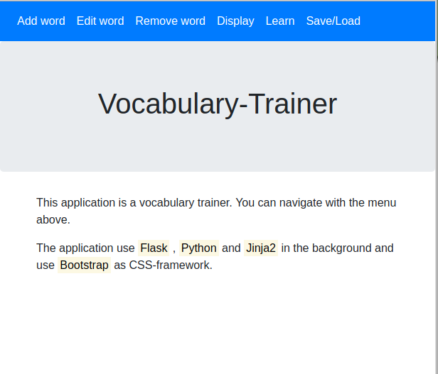

## Simple vocabulary trainer  

This Flask-App is a simple vocabulary trainer. Written with [Flask](http://flask.pocoo.org/), [Python](https://www.python.org/) and, [Jinja2](http://jinja.pocoo.org/docs/2.10/).  

You can save/load the vocabulary as a CSV-file called ```data.csv```. You will find a example [CSV-file](data.csv) in this repository.  

### How the app looks like

  

### Install the dependencies  

For this app you need Flask.  
In this repository type in:

```
$ pip install Flask
```

### Run the app

In this repository you simple run the file  ```main.py``` with Python.

```
$ python main.py
```

After that you can run the app with [ http://127.0.0.1:5000/]( http://127.0.0.1:5000/) in your web-browser.  


### Contributing

You can contribute as well to this project. Open a issue or make a pull request.  